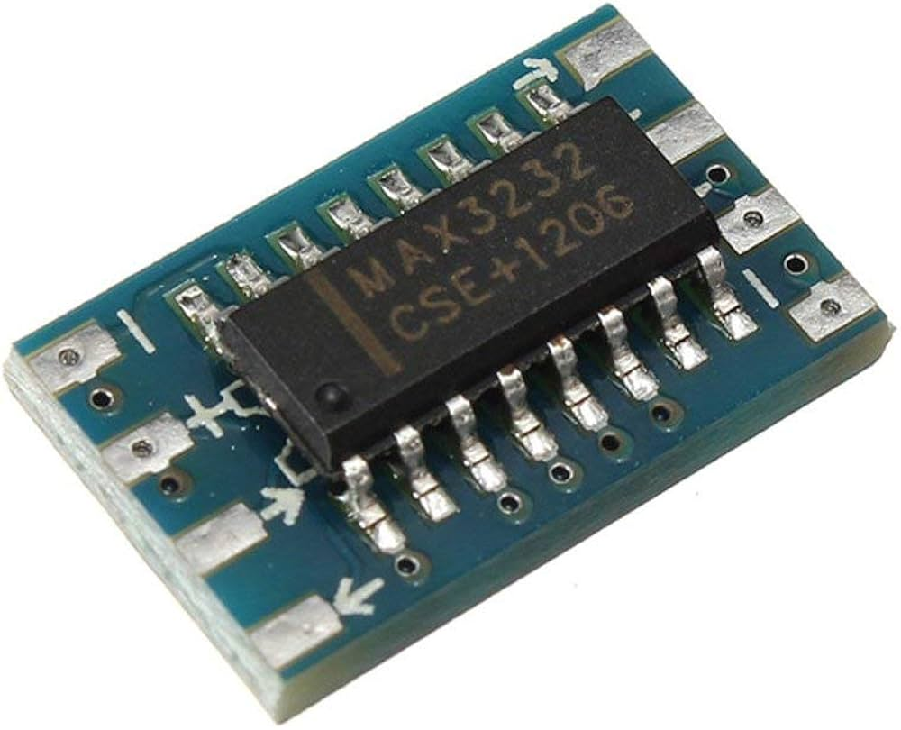

Hardware Setup
=================


You can connect to Pytes E-Box using the port labeled ***Console***.
Any connections via CAN or RS485 (e.g. to an inverter) are untouched and remain functional.

The console port offers a RS232 interface using a RJ45 connector.
The voltage levels are *not* TTL-compatible. A RS232 transceiver must be placed between the Batteries and the ESPHome device.
MAX3232-based transceivers have been tested and work well.




| ESP Pin | Transceiver | RJ45 Pin | Function |
| --- | --- | --- | --- |
| GPIO 6 | RX | ***3*** | TX |
| GND | GND | ***4*** | Ground |
| GPIO 5 | TX | ***6*** | RX |
| 3v3 | VCC | ***NC*** | Power |

 > If you have multiple batteries you need to connect to the master battery's console port.

ESPHome Setup
-------------
```yaml
esphome:

esp32:

wifi:
  ap:

logger:

api:

ota:

external_components:
  - source: github://oxynatOr/esphome-pytes_e_box
    components: [ pytes_e_box ]
    refresh: 5s

packages:
  pytes_ebox_1: 
    url: https://github.com/oxynatOr/esphome-pytes_e_box
    files:
      - path: examples/packages/pytesebox-monitor.yaml
        vars:
          pytes_e_box_id: pvbatt
          battery_num: 1
          cell_prefix: "Cell"
          battery_prefix: "Battery"
  pytes_ebox_2: 
    url: https://github.com/oxynatOr/esphome-pytes_e_box
    files:
      - path: examples/packages/pytesebox-monitor.yaml
        vars:
          pytes_e_box_id: pvbatt
          battery_num: 2
          cell_prefix: "Cell"
          battery_prefix: "Battery"     

uart:
  tx_pin: GPIO5
  rx_pin: GPIO6
  baud_rate: 115200
  rx_buffer_size: 1024
  id: uart01   

pytes_e_box:
  - id: pvbatt
    uart_id: uart01
    update_interval: 30s
    batteries: 2
    poll_timeout: 4s 
    command_idle_time: 150ms


```


